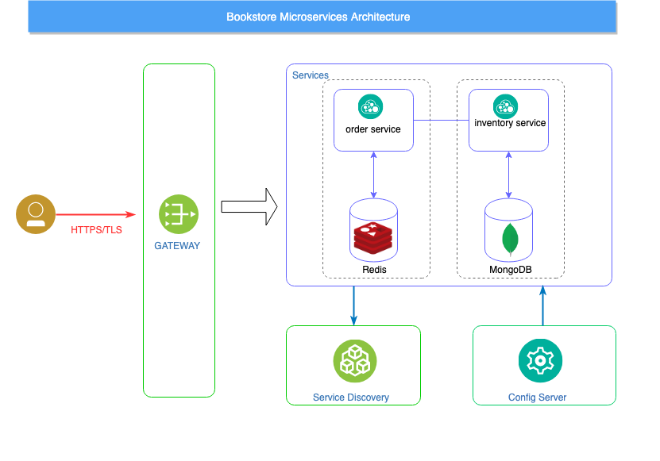

# Building Bookstore application with Microservices

### Spring Cloud Framework
- provides tools for developers to quickly build Microservices patterns in distributed systems
- provides features and components that make your application compliant with [Twelve-Factor rules](https://12factor.net).
  - Distributed/versioned configuration
  - Service registration and discovery
  - Routing
  - Load balancing
  - Circuit Breakers
  - Distributed messaging

### Architecture Design for Bookstore

- Services 
  - api-gateway
  - service-discovery
  - config-server
  - order-service
  - inventory-service



### Service endpoints

- inventory-service
  - get all items
  ```bash
  curl http://localhost:8081/inventory/items
  ```
  result:
  ```json  
  [{
    "id": "2",
    "name": "Amazon web services action",
    "quantity": 5,
    "price": 450,
    "createAt": 1574841716264
  },
  {
    "id": "3",
    "name": "Clean Architecture",
    "quantity": 5,
    "price": 500,
    "createAt": 1574841716264
  },
  {
    "id": "4",
    "name": "Mastering Machine Learning with scikit-learn",
    "quantity": 2,
    "price": 750,
    "createAt": 1574841716264
  },
  {
    "id": "1",
    "name": "Kubernetes in action",
    "quantity": 10,
    "price": 650,
    "createAt": 1574841716264
  }]
  ```
  - decrease item quantity
  
- order-service
  - get all orders
  - create an order
  ```bash
  curl --header "Content-Type: application/json" \
  --request POST \
  --data '{"itemId":"1", "quantity":2, "createAt": 0}' \
  http://localhost:8082/order/orders
  ```

